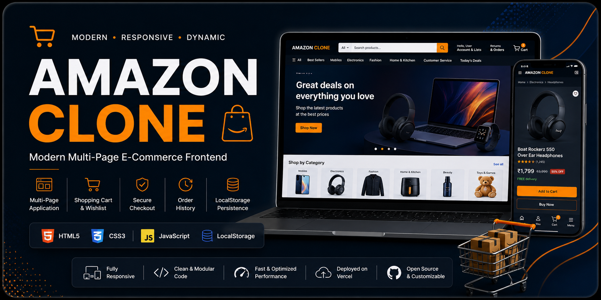
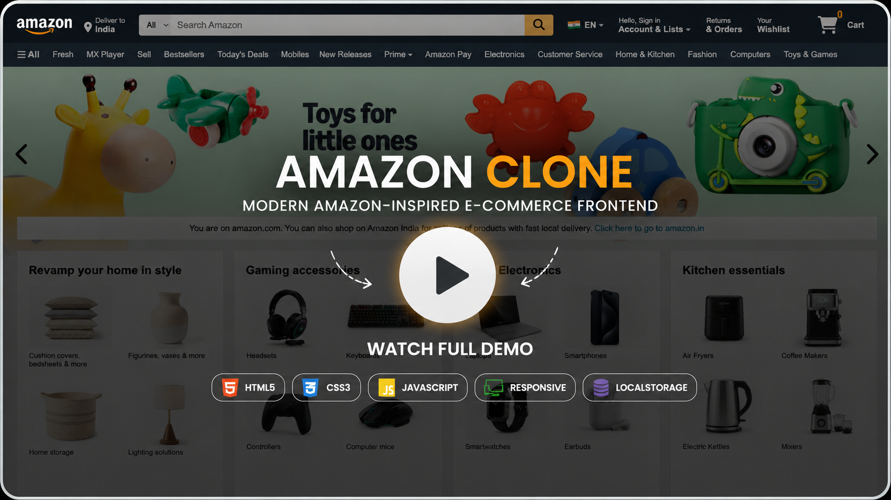
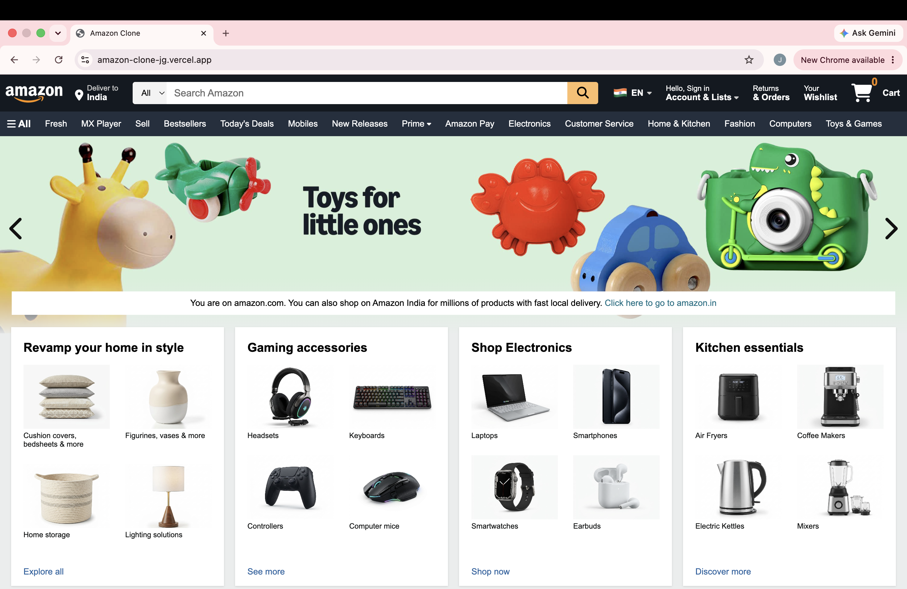
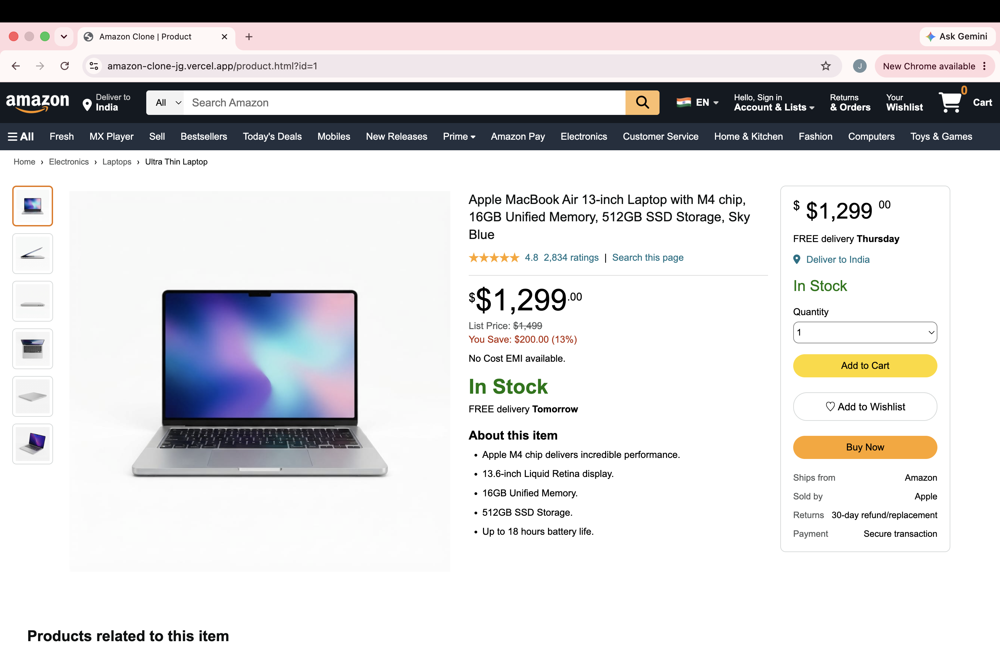
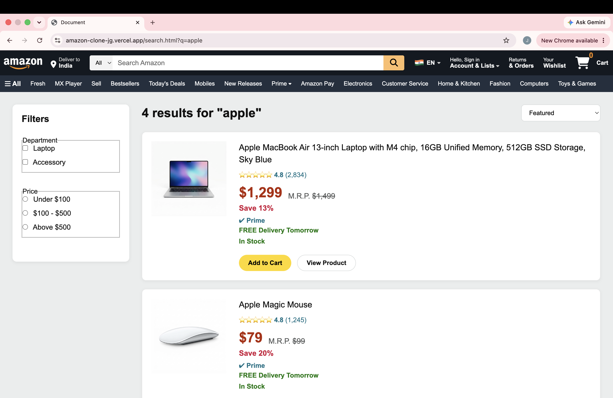
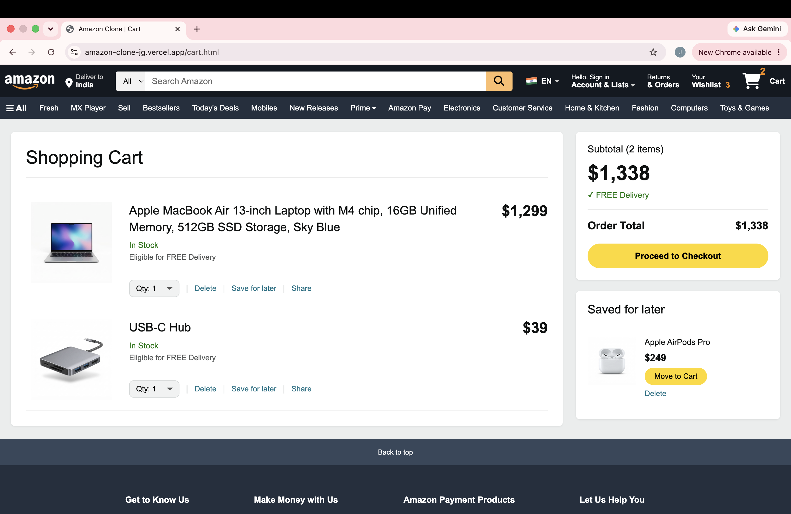
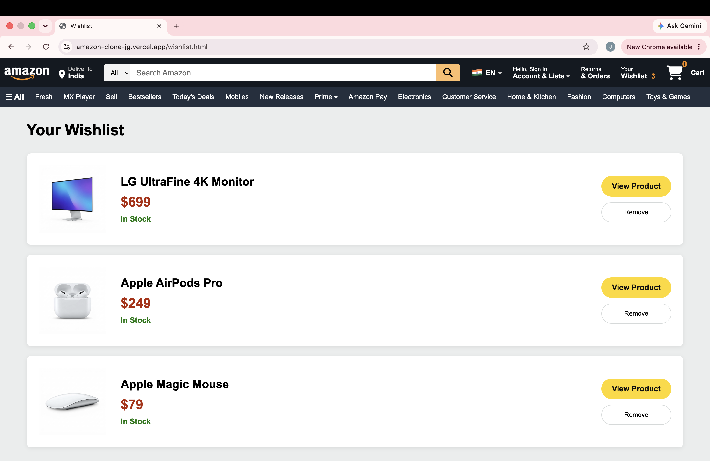
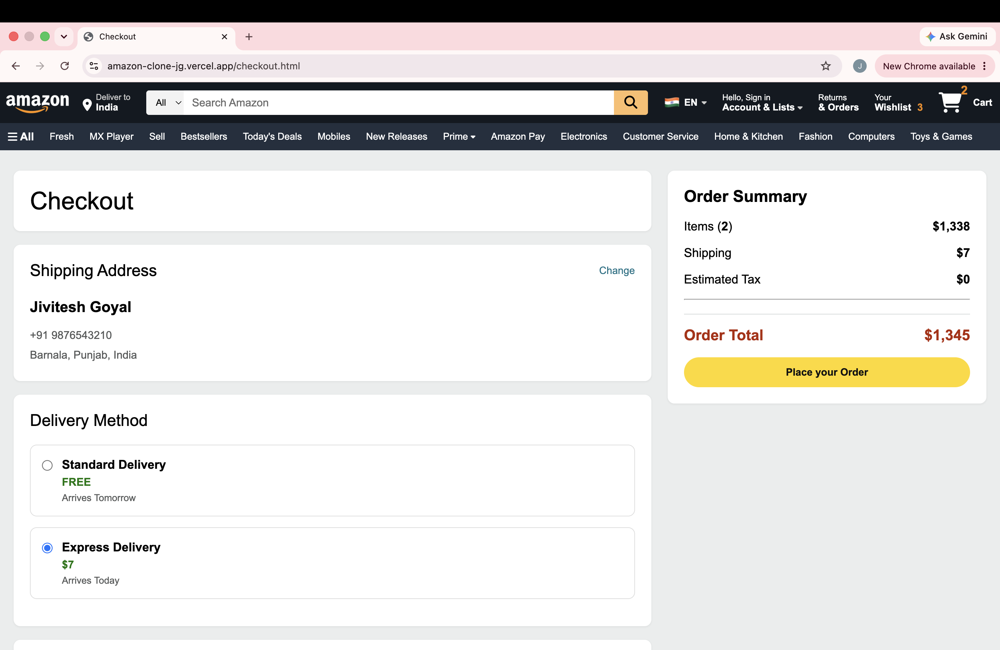
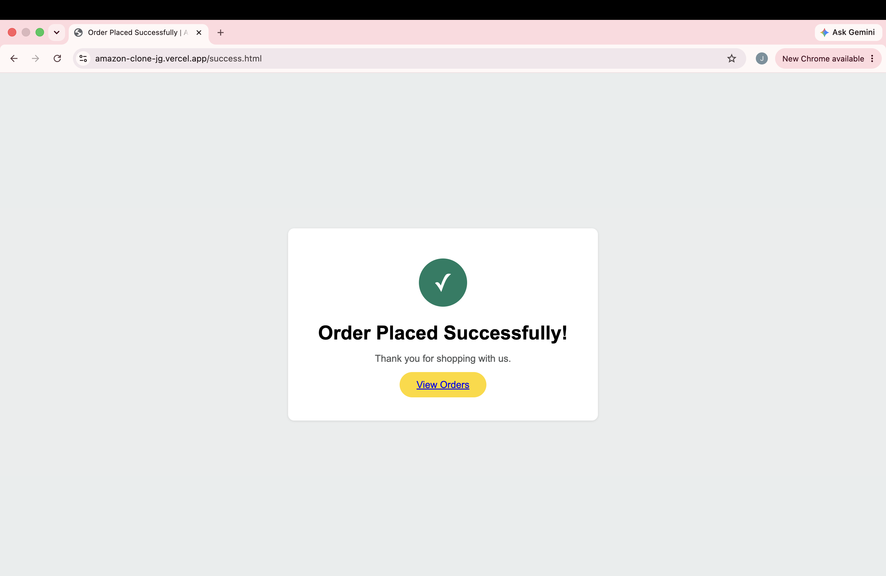
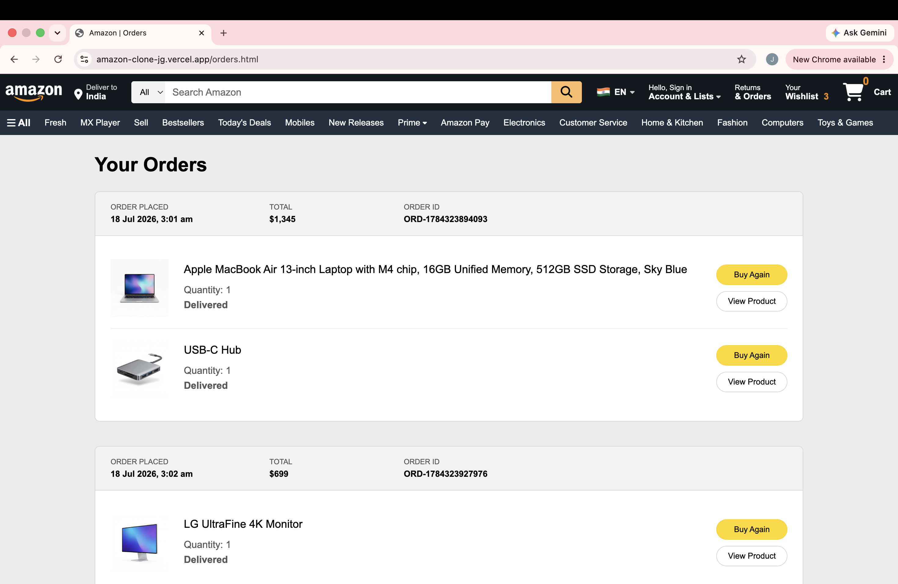

<p align="center">
  
</p>
<div align="center">

# 🛒 Amazon Clone

### Modern Amazon-Inspired Multi-Page E-Commerce Frontend

A fully responsive e-commerce frontend built with **HTML5**, **CSS3**, and **Vanilla JavaScript**, featuring a complete client-side shopping experience with persistent browser storage.

<p align="center">


</p>

### 🚀 Live Demo

**https://amazon-clone-jg.vercel.app**

### 💻 GitHub Repository

**https://github.com/jiviteshgoyal07/amazon-clone-jg**

⭐ **If you like this project, consider giving the repository a star!**

</div>

---

# 🎥 Project Demo

<div align="center">

<a href="https://youtu.be/1dk7wao4mX4">
  
</a>

### ▶ Click the image above to watch the full project demo

Experience the complete shopping flow — from product discovery and search to cart, wishlist, checkout, and order history.

</div>


---

# 📖 About the Project

**Amazon Clone** is a fully responsive, multi-page e-commerce frontend inspired by the shopping experience of Amazon and developed using **HTML5, CSS3, and Vanilla JavaScript**.

Rather than recreating only a landing page, the project simulates a complete client-side shopping experience with interconnected pages, dynamic product rendering, search, product details, cart and wishlist management, checkout, order history, recently viewed products, reusable UI components, and persistent data using the **LocalStorage API**.

The project was built to strengthen practical frontend development skills while focusing on maintainable code, modular JavaScript, responsive layouts, reusable components, and a consistent user experience.

---

# ✨ Key Features

### 🏠 Home & Product Discovery

- Responsive Amazon-inspired navigation
- Hero image slider
- Product categories and promotional sections
- Product carousels
- Recently viewed products
- Responsive layouts across screen sizes

### 📦 Product Experience

- Dynamic product detail pages
- Product image gallery
- Pricing and product information
- Related products
- Add to Cart
- Add to Wishlist

### 🔍 Search

- Live search suggestions
- Dynamic search results
- Product filtering
- Fast client-side search experience

### 🛒 Cart & Wishlist

- Add and remove products
- Quantity management
- Dynamic subtotal calculation
- Save products for later
- Persistent cart and wishlist
- Dynamic cart and wishlist counters

### 💳 Checkout & Orders

- Delivery method selection
- Dynamic order summary
- Checkout workflow
- Order confirmation page
- Persistent order history
- Buy Again functionality

### 🎨 User Experience

- Reusable navbar and footer
- Toast notifications
- Interactive product cards
- Consistent design language
- Persistent shopping data
- Responsive desktop, tablet, and mobile layouts

---

# 📸 Project Preview

<div align="center">

## 🏠 Home Page



---

## 📦 Product Page



---

## 🔍 Search Results



---

## 🛒 Shopping Cart



---

## ❤️ Wishlist



---

## 💳 Checkout



---

## ✅ Order Success



---

## 📜 Order History



</div>

---

# 🛠 Tech Stack

| Technology | Purpose |
|---|---|
| HTML5 | Semantic page structure |
| CSS3 | Styling, Flexbox, Grid & responsive layouts |
| JavaScript (ES6) | Application logic and dynamic rendering |
| LocalStorage API | Persistent cart, wishlist, orders & recently viewed data |
| Font Awesome | Interface icons |
| Git | Version control |
| GitHub | Source code hosting |
| Vercel | Deployment |

---

# 🧩 Architecture & Data Persistence

The project separates shared functionality from page-specific logic to keep the codebase organized and maintainable.

```text
User
 │
 ▼
HTML Pages
 │
 ▼
Reusable Components
Navbar • Footer
 │
 ▼
Page-Specific JavaScript
Home • Product • Search • Cart
Wishlist • Checkout • Orders • Success
 │
 ▼
Shared Utilities & Product Data
common.js • utils.js • products.js
 │
 ▼
LocalStorage API
Cart • Wishlist • Orders • Recently Viewed
```

Shared components reduce duplicated markup, while utility functions handle reusable functionality such as cart operations, product lookup, price formatting, toast notifications, and order helpers.

The **LocalStorage API** provides lightweight client-side persistence, allowing the cart, wishlist, orders, and recently viewed products to remain available after page refreshes without requiring a backend.

---

# 📂 Project Structure

```text
amazon-clone-jg/
│
├── assets/
│   ├── banners/
│   ├── carousel/
│   ├── categories/
│   ├── demo/  
│   ├── icons/
│   ├── products/
│   └── screenshots/
│
├── components/
│   ├── navbar.html
│   └── footer.html
│
├── css/
│   ├── common.css
│   ├── home.css
│   ├── product.css
│   ├── cart.css
│   ├── checkout.css
│   ├── orders.css
│   └── search.css
│
├── js/
│   ├── common.js
│   ├── utils.js
│   ├── products.js
│   ├── home.js
│   ├── product.js
│   ├── cart.js
│   ├── wishlist.js
│   ├── checkout.js
│   ├── orders.js
│   └── success.js
│
├── index.html
├── product.html
├── search.html
├── cart.html
├── wishlist.html
├── checkout.html
├── orders.html
├── success.html
├── LICENSE
└── README.md
```

---

# ⚙️ Installation & Usage

Clone the repository:

```bash
git clone https://github.com/jiviteshgoyal07/amazon-clone-jg.git
```

Move into the project directory:

```bash
cd amazon-clone-jg
```

Open the project in **VS Code**.

You can then:

- Right-click `index.html`
- Select **Open with Live Server**

Or open `index.html` directly in your browser.

### Try the Complete Shopping Flow

1. Browse products from the homepage.
2. Search for a product.
3. Open a product detail page.
4. Add products to your cart or wishlist.
5. Change quantities or save products for later.
6. Proceed through checkout.
7. Place an order and view the confirmation page.
8. Open order history and use **Buy Again**.
9. Refresh the browser to see LocalStorage persistence in action.

---

# 🧪 Challenges & What I Learned

Building this project involved solving practical frontend challenges such as:

- Organizing a multi-page application
- Managing shopping state across different pages
- Synchronizing LocalStorage data
- Dynamically rendering products
- Implementing product search
- Creating reusable components
- Building responsive layouts
- Debugging DOM-related behavior
- Maintaining an organized project structure

Through the project, I strengthened my understanding of:

- Semantic HTML and page organization
- CSS Flexbox, Grid, media queries, and responsive design
- JavaScript DOM manipulation and event handling
- Arrays, objects, ES6 features, and dynamic rendering
- LocalStorage and client-side state management
- Reusable frontend components
- Multi-page frontend architecture
- Git and GitHub workflow
- Deployment with Vercel
- Debugging and problem-solving in a larger frontend project

---

# 🗺 Roadmap

The current version is a stable frontend implementation.

Possible future enhancements include:

- [ ] Backend integration
- [ ] User authentication
- [ ] Database integration
- [ ] REST API
- [ ] Payment gateway integration
- [ ] Product reviews and ratings
- [ ] Advanced product filters and sorting
- [ ] Order tracking
- [ ] User profiles
- [ ] Product recommendations
- [ ] Dark mode
- [ ] Admin dashboard

---

# 🤝 Contributing

Contributions, suggestions, and improvements are welcome.

1. Fork the repository.

2. Create a feature branch:

```bash
git checkout -b feature/amazing-feature
```

3. Commit your changes:

```bash
git commit -m "Add amazing feature"
```

4. Push the branch:

```bash
git push origin feature/amazing-feature
```

5. Open a Pull Request.

---

# 📄 License

This project is licensed under the **MIT License**.

---

# ⚠️ Disclaimer

This project was developed solely for **educational and portfolio purposes**.

It is an independent frontend implementation inspired by the shopping experience of Amazon and is **not affiliated with, endorsed by, sponsored by, or associated with Amazon**.

All trademarks and brand names belong to their respective owners.

---

# 👨‍💻 Author

<div align="center">

## Jivitesh Goyal

Computer Science Engineering Student

Interested in **Frontend Development, UI Engineering, and building modern web applications**.

### Connect

**GitHub:** https://github.com/jiviteshgoyal07

</div>

---

# 🙏 Acknowledgements

Helpful learning and reference resources used during development include:

- MDN Web Docs
- Font Awesome
- Git Documentation
- GitHub Documentation
- Vercel Documentation
- The open-source developer community

---

<div align="center">

### ⭐ If you found this project useful, consider starring the repository.

Made with ❤️ using **HTML, CSS & JavaScript**

</div>